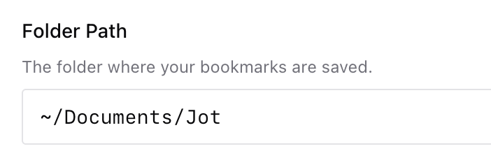
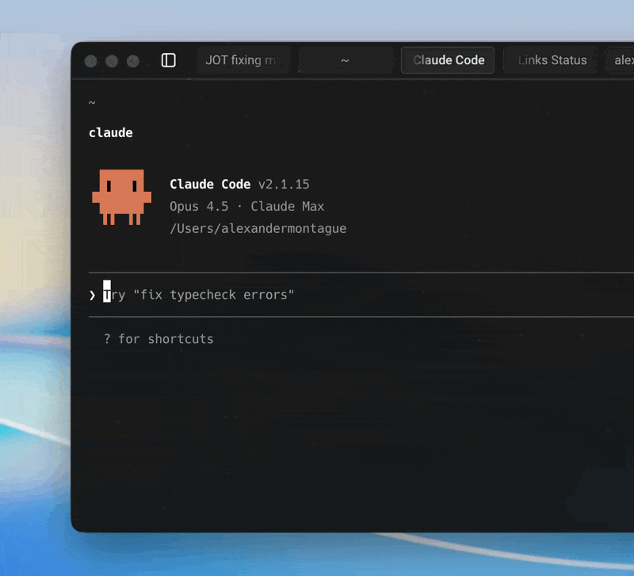

<p align="center">
  
</p>

<h1 align="center">Jot</h1>

<p align="center">Modern bookmarks, captured locally – for you and Claude Code</p>

<p align="center"><a href="https://github.com/alexanderjmontague/jot/releases/latest"><strong>→ Download Latest Release</strong></a></p>

---

### Let Jot write bookmarks to a local folder

<p align="center">
  
</p>

### Add notes & comments on any webpage

<p align="center">
  
</p>

### Let Claude Code see and organize them locally

<p align="center">
  
</p>

> [!WARNING]
> Not yet on the Chrome Web Store. Requires "Load unpacked" installation.

---

## What is this?

Capture your thoughts and ideas on any webpage to help you organize and contextualize the internet. Read them later yourself, or use local agents like Claude Code and Codex to quickly find your bookmarks, reference your notes, and organize them into folders.

Your notes stay local. The extension talks directly to your filesystem through a tiny helper app (no servers, no sync, no BS).

## Install

Download [`jot-extension.zip`](https://github.com/alexanderjmontague/jot/releases/latest/download/jot-extension.zip), unzip it, and load it in Chrome using [Developer mode](https://developer.chrome.com/docs/extensions/get-started/tutorial/hello-world#load-unpacked). Then follow the setup instructions in the extension.

Works with Chrome, Arc, Brave, Edge, and other Chromium browsers.

**Keyboard shortcut:** `⇧⌘E` (Shift+Cmd+E) to open Jot on any page.

---

## How it works

```
Chrome Extension  ←→  Native Helper  ←→  Obsidian Vault
                      (local only)        ~/Vault/Jot/*.md
```

Each page you comment on gets its own markdown file:

```markdown
---
url: "https://example.com/article"
title: "Some Article"
created_at: 2025-01-10T14:30:00.000Z
---

## Comments

### 2025-01-10 14:30
This is a really interesting point about...
```

---

## Development

Want to build from source?

```bash
git clone https://github.com/alexanderjmontague/jot.git
cd jot
pnpm install
pnpm build
```

Then load `.output/chrome-mv3` as an unpacked extension.

For the native helper, you'll need Xcode:

```bash
cd native-host-swift
./install.sh
```

---

## Uninstall

To fully remove the native helper:

```bash
# Remove the binary
sudo rm /usr/local/bin/jot-host

# Remove browser manifests (for whichever browsers you have)
rm ~/Library/Application\ Support/Google/Chrome/NativeMessagingHosts/com.jot.host.json
rm ~/Library/Application\ Support/Arc/User\ Data/NativeMessagingHosts/com.jot.host.json
rm ~/Library/Application\ Support/BraveSoftware/Brave-Browser/NativeMessagingHosts/com.jot.host.json
# ... etc for other browsers

# Remove config
rm -rf ~/.jot
```

